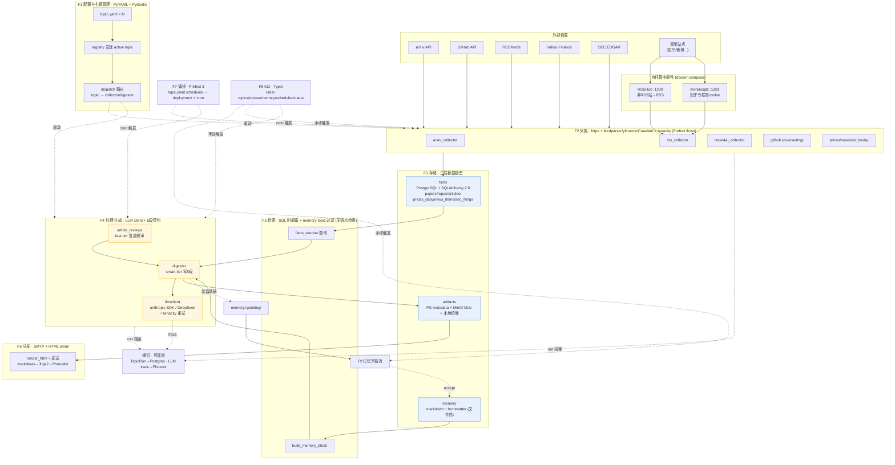

# ISBE 功能架构与技术路线图（重构基线）

> 本文档描述的是**代码现状**（截至 `0b6aa6c ready for open source`），不是 spec 里的愿景。
> 凡 spec / AGENTS.md 与代码冲突处，**以本文档为准**，并在文末 §7 列出需要回填修正的文档。
>
> 用途：重构第 1 步。先把"系统现在到底由哪些功能块组成、各自用什么技术栈、边界在哪"画清楚，
> 后续每一步重构都对照这张图，确认动的是哪一块、会不会越过边界。

---

## 0. 一句话功能定位

ISBE 是一条**确定式的周期性信息管线**：按 `topic.yaml` 配置，定时从外部信源采集"原子事实"，
用 LLM 按固定 5 段模板把"本期值得读的内容"写成日/周报，并把产出归档 + 邮件推送。
全程**单向数据流**，无 ReAct 循环，无运行时自改代码（红线 #1 / #5）。

---

## 1. 功能边界总览（按红线单向流切分）

红线 #1：`采集 → 处理 → 存储 → 检索 → 生成 → 分发`，禁止反向调用。
下表是当前实现的 9 个功能块，每块一行边界 + 技术路线：

| # | 功能块 | 边界（负责什么 / 不负责什么） | 技术路线（核心库/服务） | 代码位置 |
|---|--------|------------------------------|------------------------|----------|
| F1 | **配置与主题管理** | 加载/校验 `topic.yaml`，发现 active topic，把 topic → flow 路由；不含业务逻辑 | PyYAML + Pydantic v2（`extra=forbid`），目录扫描发现 | `topics/{config,registry,dispatch}.py` |
| F2 | **采集（Collection）** | 从外部信源拉数据写入 facts 表；不做去重以外的清洗、不做分析 | httpx + feedparser / arxiv API / yfinance / SEC EDGAR / GitHub API / Crawl4AI；tenacity 重试；全部 Prefect flow | `topics/_shared/{rss,arxiv,crawl4ai_collector}.py`、`topics/*/collectors/*.py` |
| F3 | **存储 · 三层数据模型** | facts（原子事实）/ artifacts（LLM 产出）/ memory（人的知识），三层永不混用 | PostgreSQL + SQLAlchemy 2.0 + psycopg3；MinIO blob；文件式 markdown+frontmatter | `facts/*`、`artifacts/store.py`、`memory/*` |
| F4 | **处理 · 生成（Digest）** | 读 facts×memory → LLM 走 5 段契约 → 产出 artifact + 蒸馏草稿；不直接落正式 memory | LLM client（anthropic SDK / DeepSeek OpenAI-compat）+ tenacity；字符串 prompt + Jinja2 渲染 | `topics/_shared/{digester,articles_digester,article_reviews,comparison}.py`、`topics/*/digester.py`、`llm/*` |
| F5 | **检索（Retrieval）** | 给 digester 喂"时间窗内的 facts" + "本 topic 相关 memory"；当前是 SQL 时间窗 + 文件过滤，**无语义检索** | SQLAlchemy 时间窗查询 + `build_memory_block()` topic 过滤；Qdrant 预留未启用 | `_shared/digester_utils.py`、各 `facts.py` 的 `*_keyword_filter` |

> **⚠ F5 边界修订（2026-06-03）**：此行"检索 = SQL 时间窗"的写法掩盖了一个结构性缺口——**相关性 / 检索质量无主，不可测**。
> 详见 [2026-06-03 检索契约与评估设计](2026-06-03-retrieval-contract-and-eval.md)：在 F2 与 F4 间应插入一等公民块
> **FT Triage（选品与相关性）** + 旁路 **Eval（检索评估）**，二者共享一份"检索契约"。下表 §4 的 F5「低 🔧」即指此。
| F6 | **分发 · 通知（Notify）** | 把生成的 digest 推送给用户；失败绝不让管线 fail | smtplib（STARTTLS/SSL）+ markdown→HTML + Jinja2 + Premailer 内联 CSS | `notify/render.py` |
| F7 | **编排 · 调度（Orchestration）** | 从 `topic.yaml.schedules` 生成 Prefect deployment + cron，长进程触发；状态可恢复（红线 #3） | Prefect 3（`to_deployment` + `serve`） | `scheduler.py`、`dispatch.py` |
| F8 | **接口（CLI）** | 人手动触发采集/生成、审核 memory、看状态；不含业务逻辑（仅编排调用） | Typer（4 个 subapp + `status`） | `cli/*` |
| F9 | **记忆审核流（Memory lifecycle）** | 草稿→review→accept/reject→重建索引→归档；红线 #2/#6 的落地 | python-frontmatter + Pydantic + 文件操作 | `memory/{pending,lifecycle,lint,loader}.py`、`cli/review.py` |

**横切关注点（贯穿 F2–F7）**：

| 关注点 | 技术路线 | 代码位置 |
|--------|----------|----------|
| 运行档案 | `TopicRun` ORM → Postgres `topic_runs` 表（context manager 包裹每个 flow） | `observability/runs.py` |
| LLM trace | OpenTelemetry + OpenInference 属性 → Phoenix（env 配则上报，否则 no-op） | `llm/client.py` |
| 配置/密钥 | env vars（`.env`），`config.py` 不读 memory、memory 不读 env（模块边界铁律） | `config.py` |

---

## 2. 技术框架图

**怎么读这张图**：左上是外部世界，反爬站点经自托管中间件（RSSHub/morerssplz）转成 RSS 再进采集层；
F1 不在数据流上而是"驱动者"（虚线），决定哪些 flow 跑、喂什么参数；
实线 = 数据流（严格单向，红线 #1）；虚线 = 控制流 / 旁路（调度触发、trace 上报、蒸馏草稿回流到审核队列）。
**蒸馏草稿到正式 memory 之间隔着 F9 人工审核**，这是红线 #2/#6 的物理体现——agent 永远不直接写正式目录。

---

## 3. 各功能块技术路线详解

### F1 配置与主题管理
- **零代码加新 topic**：放一份 `topic.yaml` 进 `topics/<id>/`，`registry.discover_topics()` 启动时扫目录、`TopicConfig.model_validate()` 校验（`extra=forbid` 挡 typo），无效配置启动即失败。
- **路由三段式**（`dispatch.resolve_flow`）：schedule_key 先查共享 collector 套餐（arxiv/rss/crawl4ai）→ 再查 `digester` → 再查 topic 私有 `collectors/*`。`_pass_topic_id_if_accepted()` 按 flow 签名决定是否注入 `topic_id`。
- 这是 v1 "加域即胜利" 的杠杆点：6 个 topic 大多只靠 yaml。

### F2 采集
- **统一接口**：仅一个 `Collector` Protocol（Prefect flow，返回新增行数 `int`），**无共享基类**，各 collector 自己写 DB session / upsert / 错误处理。
- **三个共享套餐**（参数化、吃 `topic_id`）：`rss`（feedparser，SHA1(source+url) 去重）、`arxiv`（feedparser+tenacity，遵守 1req/3s）、`crawl4ai`（本地 Chrome + LLM 抽取，cookie 注入）。
- **5 个私有 collector**：nowcasting 的 `arxiv-pdf`（httpx 多镜像故障转移 + MinIO）、`github`（REST API，**仓库列表硬编码** ← 重构信号）；nvda 的 `prices`（yfinance+pandas）、`news`（轻量 RSS）、`sec`（EDGAR JSON）。
- **不统一处**：去重策略（SHA1 / arxiv_id / 复合 PK 各一套）、错误粒度（per-feed vs flow-level）、配置来源（yaml vs 硬编码）。

### F3 存储 · 三层数据模型（系统 backbone）
- **facts**：SQLAlchemy 2.0 声明式 + psycopg3 + PostgreSQL。表：`papers`/`repos`/`events`（nowcasting）、`prices_daily`/`news_items`/`sec_filings`（nvda）、`articles`（通用 RSS）。可重抓、可删。
- **artifacts**：PG `artifacts` 表存元数据指针（含 `fingerprint` JSONB 记录上游 facts id + memory revision = **血缘可追溯**），正文 markdown 进 MinIO（`{topic}/{period}/{id}.md`）+ 本地镜像（`latest.md` + `.history/`）。归档用，不喂回 prompt。
- **memory**：python-frontmatter 解析，Pydantic `MemoryFrontmatter`（5 类型：user/feedback/topic/reading/reference；body ≤4KB；revision/supersedes 链）。一条一文件，git 友好，人可 vim。
- **边界清晰**：facts↔artifacts↔memory 三者互不读对方内部结构，仅 digester 在 F4 把 facts×memory 读到一起。

### F4 处理 · 生成
- **5 段契约**（`docs/.../2026-05-13-digest-contract-v1.md` 固化）：TL;DR / 逐条点评 / 跨条对照 / 分析 / 蒸馏。落地为 `DigestResult{sections[], fingerprint, pending_drafts[]}`。
- **三种 digester 形态**：① arxiv-weekly（`_shared/digester.py`，Paper+Repo 硬编码）；② article 工厂（`make_articles_digester(...)`，motorcycle/china-tech 各 4 行声明复用，含 fast-tier 批量预审 `article_reviews` 防 OOM）；③ finance（nvda bespoke，3 个独立时间窗 + 隐私红线 prompt）。
- **LLM client**：`ISBE_LLM_PROVIDER=anthropic|deepseek` 一个 env 切换；anthropic 走官方 SDK，deepseek 走 OpenAI-compat HTTP；tier（fast/smart）映射模型；tenacity 重试 429/5xx/timeout。
- **prompt 组织**：system + user prompt 是**硬编码字符串 + `str.format()`**（非 Jinja）；**只有 artifact 渲染用 Jinja2**（`templates/*.j2`）。改模板必须更新 golden（红线 #7）。

### F5 检索
- 当前 = **时间窗 SQL 过滤**（`facts_window()` 按 `digest.*_window_days`）+ **memory topic 过滤**（`build_memory_block()`，type=topic 按 `<topic_id>.` 前缀匹配，feedback/user 全局）。
- **Qdrant 容器在跑但未接线**——语义检索是 v2，是这一层最明显的"预留待填"。

### F6 分发
- `send_digest_notification()`：必需 env（HOST/FROM/TO），multipart（纯文本兜底 + HTML 可选）。HTML = markdown→html→Jinja2(`email.html.j2`)→Premailer 内联 CSS。
- **失败哲学**：未配置则 no-op；HTML 渲染失败降级纯文本；发送失败仅 warn 不 raise——**通知绝不拖垮管线**。

### F7 编排
- `scheduler.serve_topics()`：遍历 active topic 的 `schedules` 块 → 每个 `(topic_id, schedule_key)` 经 dispatch 解析出 flow → `flow.to_deployment(cron=...)` → `prefect.serve(*deployments)` 长进程。
- 新增 topic **不碰 scheduler.py**。状态持久化在 Prefect（红线 #3 断点续跑）。

### F8 接口
- Typer。命令组：`radar topics {list,run}` / `review memory` / `memory {reindex,archive}` / `scheduler serve` / `status`。
- `topics run --collect --digest` 同步调 flow 返回计数；`status` 查 `topic_runs` 表聚合每 topic 最近 collect/digest/fail。

### F9 记忆审核流
- 红线 #2「学到的一切都是文件、走草稿→审核→落盘→索引」+ 红线 #6「人有绝对优先权」的实现。
- `write_pending`（digester 蒸馏产出落 `.pending/`）→ `cli/review.py` 显示 diff → `accept_pending`（落正式目录，**当前不跑 lint** ← 已知短板）/ `reject_pending`（进 `.audit/rejected/`）→ `reindex_memory_md`（重建 `MEMORY.md`）。`lifecycle.archive_old_reading` 自动归档 8 周+ reading。
- **注意 v1 现状**：按 2026-05-12 ADR，v1 期 agent 写回审核流**设计保留但 agent 侧未真正启用**，当前 memory 主要靠用户手写；蒸馏草稿生成是通的，accept 闭环可用。

---

## 4. 当前抽象程度评估（重构入口预判）

| 功能块 | 抽象成熟度 | 重构信号（下一步细看） |
|--------|-----------|----------------------|
| F1 配置/路由 | 高 ✅ | 路由约定隐式（靠命名/签名反射），缺显式注册表文档 |
| F2 采集 | 中 ⚠️ | 只有 Protocol 无基类 → upsert/去重/错误处理各写各的；github 仓库列表硬编码；去重策略 3 套不统一 |
| F3 存储 | 高 ✅ | 三层边界干净；facts 各 topic 表 schema 分散在 `topics/*/facts.py`，缺集中视图 |
| F4 生成 | 中高 ⚠️ | 工厂模式好，但 prompt 硬编码字符串 + 三种 digester 形态并存；prompt 与渲染模板分离度可再抽 |
| F5 检索 | 低 🔧 | 仅时间窗；Qdrant 预留未启用（v2，非本轮重构目标） |
| F6 分发 | 高 ✅ | 单一职责清晰 |
| F7 编排 | 高 ✅ | dispatch 反射式解析偏"魔法"，可读性可提升 |
| F8 CLI | 高 ✅ | — |
| F9 审核流 | 中 ⚠️ | accept 不跑 frontmatter lint（已知短板）；agent 写回侧 v1 未启用 |

> 本表只是**信号标注**，不是重构方案。具体改什么、改不改、顺序如何，留到重构第 2 步（逐块定方案）再定。

---

## 5. 自托管基础设施清单（docker-compose）

| 服务 | 端口 | 在架构中的角色 | 状态 |
|------|------|---------------|------|
| postgres | 5432 | F3 facts + artifacts metadata + topic_runs + Prefect 元数据 | 必需 |
| minio | 9000/9001 | F3 artifacts blob | 必需 |
| prefect-server | 4200 | F7 调度（唯一对外端口） | 必需 |
| phoenix | 6006 | 横切 LLM trace | 可选 |
| rsshub | 1200 | F2 非 RSS 站 → RSS | 按需 |
| morerssplz | 1201 | F2 知乎专栏零 cookie 兜底 | 按需 |
| qdrant | 6333 | F5 语义检索**预留**（未接线） | 未启用 |
| uptime-kuma | 3001 | 服务健康 | 可选 |
| radar-worker | — | F7 worker（profile: worker，bind memory/artifacts/papers） | 可选 |

---

## 6. 边界铁律（重构时不可越过）

引自 spec §1.3 + AGENTS.md，重构每一步都要自查：

1. `config.py` 不读 memory；`memory/*` 不读 env
2. `cli/*` 不含业务逻辑（只编排调用）
3. `workflows`/flow 调用工具但不写工具实现
4. `models.py` / facts schema 不做 IO
5. 数据流严格单向（F1→…→F6），**禁止反向调用**
6. agent 永远不直接写正式 memory（必经 F9 审核）

---

## 7. 文档需回填修正项（重构产生的诚实化债务）

重构过程中应顺手修正以下"文档 ≠ 代码"处：

1. **AGENTS.md「已锁定关键技术决策」表**仍写"路径 B：在 hermes-agent 上叠加 / LLM 网关 hermes 自带 / 通知 hermes 多平台 gateway"——这些**已被 2026-05-12 ADR 推翻**，实际是自建 lite（Prefect + 自研 LLM client + SMTP）。表格应加 banner 或改写。
2. AGENTS.md 仓库结构示例写 `F:\codes\ISBE\`，实际在 `E:\codes\github\ISBE`。
3. AGENTS.md 提到 `topics.yaml`（单文件）+ `workflows/` 顶层目录，实际是 `topics/<id>/topic.yaml`（每域一份）+ 无顶层 workflows 目录（flow 在 `topics/*/` 内）。
4. README「已知短板」与本文 §4 信号表应保持同步。

---

## 附：术语对齐（防串台，引自 spec 附录 B）

- **F1–F9** = 本文功能块编号（仅本重构文档使用）
- **C1/C2/C3** = 内容沉淀层（C1 原始资料/MinIO、C2 行为痕迹/read flag、C3 提炼洞察/topics）
- **L1–L4** = 自扩展光谱（v2，本轮不碰）
- **T1/T2/T3** = 记忆加载层（v2）

三套维度互不相干，勿混用。
